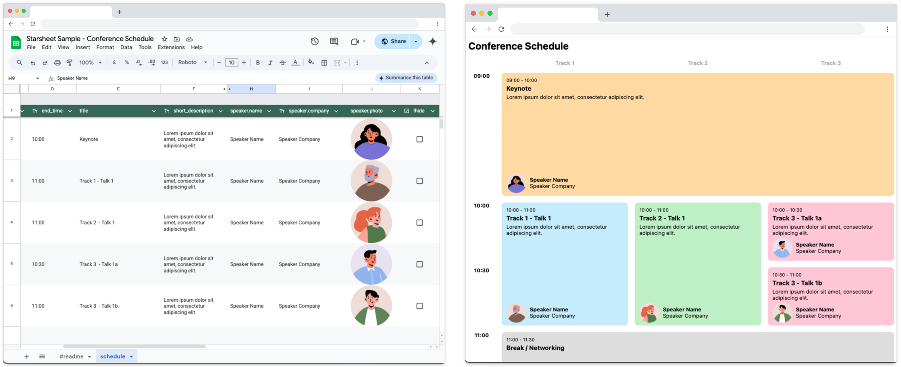
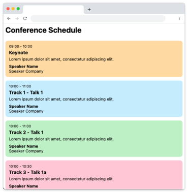

# Starsheet - Web Sample Project

This sample project demonstrates how [Starsheet](https://starsheet.app) can be used to turn Google Sheets into a headless CMS, and use it to create a remotely editable web page using just HTML and Javascript with no backend. In this example we'll be creating a schedule for a conference. 

## What is Starsheet

[Starsheet](https://starsheet.app) is an online service that generates a JSON feed from a Google Sheet and publishes it to S3/CloudFront on your AWS account, essentially turning Google Sheets into a simple headless CMS, with no infrastructure to maintain and at the fraction of the cost of a managed service like Contentful. 

The advantage of publishing it to your own AWS account is there's no artifical caps on bandwidth or visitors. You pay AWS usage fees directly so there's no markup, and in many cases will fall within free usage allowances offered by AWS. 

## What we're building



Using Starsheet we'll publish [this Google Sheet](https://docs.google.com/spreadsheets/d/1FCv1tQkLStavZraLRJkGYBZxs_5j6o4mn4C5jXu2SMQ/edit?gid=0#gid=0) to [this JSON feed](https://demo.starsheet.app/schedule/live.json) which will then be consumed like an API by a static website. 

There's two versions of the sample project created from this tutorial. A [basic version](https://web.samples.starsheet.app/basic) which shows a working Starsheet integration in as few lines of code as possible, and a [finessed version](https://starsheet-web-sample.pages.dev/grid) with a responsive desktop and mobile layout. 

The complete source code is available [on Github](https://github.com/Starsheet/web-sample).

## Building the website

We'll start by consuming the already published JSON feed. 

By default Starsheet sets CORS headers to allow cross-domain requests to the JSON feed so the data can be loaded by simply using the Javascript Fetch API. 

```Javascript
fetch('https://demo.starsheet.app/schedule/live.json')
.then((response) => response.json())
.then((json) => console.log(json));
```
For the purposes of the tutorial we're going to use [Alpine.js](https://alpinejs.dev/) to render the data from the JSON feed, but because we're simply consuming a JSON feed as you would with many APIs any Javascript framework can be used including React, Angular and Svelte. 

### Initial Implementation

The steps for the initial implementation are:

1. Include Alpine.js (for the purposes of the demo we're loading from Cloudflare's JS CDN)
2. Use `addEventListener` to listen for the `alpine:init` event and use that to register a "schedule" component, which requests the JSON feed on `init()`, storing the response data so it's available when rendering the component
3. Define the HTML structure of the schedule component using Alpine's `x-data` directive. In the component we use Alpine's `x-for` directive to render a set of HTML for each item in the "schedule" array 
4. Display a simple loading message by default by setting a loading property to true by default, changing it's state once the JSON feed is loaded and using `x-show` directives in the component

Here's the complete code for the initial implementation: 

```HTML
<html>
<head>
    <title>Starsheet Sample - Conference Schedule</title>
    <meta name="viewport" content="width=device-width, initial-scale=1" />
    <script defer src="https://cdnjs.cloudflare.com/ajax/libs/alpinejs/3.14.8/cdn.min.js"></script>
    <link href="css/base.css" rel="stylesheet" />
</head>
<body>
    <h2>Conference Schedule</h2>

    <div x-data="schedule">

        <div class="loading" x-show="loading">
            Loading data...
        </div>

        <div x-show="!loading && !error" class="schedule">

            <template x-for="session in data.schedule">
                <div class="session" :class="`track-${session.track} type-${session.type}`">

                    <div class="session-info">
                        <span class="time" x-text="`${session.start_time} - ${session.end_time}`"></span>
                        <h3 x-text="session.title"></h3>
                        <p x-text="session.short_description"></p>
                    </div>

                    <template x-if="session.type === 'talk'">
                        <div class="speaker">
                            <div class="info">
                                <span class="name" x-text="session.speaker.name"></span>
                                <span class="company" x-text="session.speaker.company"></span>
                            </div>
                        </div>
                    </template>

                </div>
            </template>

        </div>

    </div>

    <script>
        document.addEventListener('alpine:init', () => {
            Alpine.data('schedule', () => ({
                dataUrl: 'https://demo.starsheet.app/schedule/live.json',
                data: {},
                loading: true,
                error: null,
                init() {
                    this.loadRemoteData();
                },
                loadRemoteData() {
                    fetch(this.dataUrl)
                    .then((response) => response.json())
                    .then((json) => {
                        this.data = json;
                        this.loading = false;
                    })
                }
            }));
        });
    </script>
</body>
</html>
```

A [simple stylesheet](https://github.com/Starsheet/web-sample/blob/main/source/css/base.css) is referenced, which colorizes the sessions based on the `type-*` and `track-*` class names which are dynamically constructed from the JSON data. 

