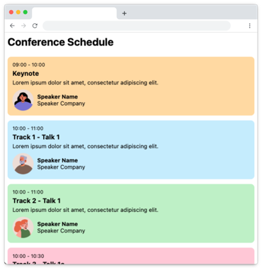
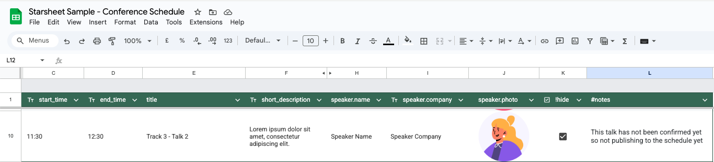

# Starsheet - Web Sample Project

This sample project demonstrates how [Starsheet](https://starsheet.app) can be used to turn Google Sheets into a headless CMS, and use it to create a remotely editable web page using just HTML and Javascript with no backend. In this example we'll be creating a schedule for a conference. 

## What is Starsheet


[Starsheet](https://starsheet.app) is an online service that generates a JSON feed from a Google Sheet and publishes it to S3/CloudFront on your AWS account, essentially turning Google Sheets into a simple headless CMS, with no infrastructure to maintain and at the fraction of the cost of a managed service like Contentful. 

The advantage of publishing it to your own AWS account is there's no artifical caps on bandwidth or visitors. You pay AWS usage fees directly so there's no markup, and in many cases will fall within free usage allowances offered by AWS. 

## What we're building in this sample project


Using Starsheet we'll publish [this Google Sheet](https://docs.google.com/spreadsheets/d/1FCv1tQkLStavZraLRJkGYBZxs_5j6o4mn4C5jXu2SMQ/edit?gid=0#gid=0) to [this JSON feed](https://demo.starsheet.app/schedule/live.json) which will then be consumed like an API by a static website. 

There's two versions of the sample project created from this tutorial. A [basic version](https://web.samples.starsheet.app/basic) which shows a working Starsheet integration in as few lines of code as possible, and a [finessed version](https://starsheet-web-sample.pages.dev/grid) with a responsive desktop and mobile layout. 

The complete source code is available [on Github](https://github.com/Starsheet/web-sample).

## Creating the website

We'll start by consuming the already published JSON feed. 

By default Starsheet sets CORS headers to allow cross-domain requests to the JSON feed so the data can be loaded by simply using the Javascript Fetch API. 

```Javascript
fetch('https://demo.starsheet.app/schedule/live.json')
.then((response) => response.json())
.then((json) => console.log(json));
```
For the purposes of the tutorial we're going to use [Alpine.js](https://alpinejs.dev/) to render the data from the JSON feed, but because we're simply consuming a JSON feed as you would with many APIs any Javascript framework can be used including React, Angular and Svelte. 

### Initial implementation

The steps for the initial implementation are:

1. Include Alpine.js (for the purposes of the demo we're loading from Cloudflare's JS CDN)
2. Use `addEventListener` to listen for the `alpine:init` event and use that to register a "schedule" component, which requests the JSON feed on `init()`, storing the response data so it's available when rendering the component
3. Define the HTML structure of the schedule component using Alpine's `x-data` directive. In the component we use Alpine's `x-for` directive to render a set of HTML for each item in the "schedule" array 
4. Display a simple loading message by default by setting a loading property to true by default, changing it's state once the JSON feed is loaded and using `x-show` directives in the component

Here's the complete code for the initial implementation: 

```HTML
<html>
<head>
    <title>Starsheet Sample - Conference Schedule</title>
    <meta name="viewport" content="width=device-width, initial-scale=1" />
    <script defer src="https://cdnjs.cloudflare.com/ajax/libs/alpinejs/3.14.8/cdn.min.js"></script>
    <link href="css/base.css" rel="stylesheet" />
</head>
<body>
    <h2>Conference Schedule</h2>

    <div x-data="schedule">

        <div class="loading" x-show="loading">
            Loading data...
        </div>

        <div x-show="!loading && !error" class="schedule">

            <template x-for="session in data.schedule">
                <div class="session" :class="`track-${session.track} type-${session.type}`">

                    <div class="session-info">
                        <span class="time" x-text="`${session.start_time} - ${session.end_time}`"></span>
                        <h3 x-text="session.title"></h3>
                        <p x-text="session.short_description"></p>
                    </div>

                    <template x-if="session.type === 'talk'">
                        <div class="speaker">
                            <div class="info">
                                <span class="name" x-text="session.speaker.name"></span>
                                <span class="company" x-text="session.speaker.company"></span>
                            </div>
                        </div>
                    </template>

                </div>
            </template>

        </div>

    </div>

    <script>
        document.addEventListener('alpine:init', () => {
            Alpine.data('schedule', () => ({
                dataUrl: 'https://demo.starsheet.app/schedule/live.json',
                data: {},
                loading: true,
                error: null,
                init() {
                    this.loadRemoteData();
                },
                loadRemoteData() {
                    fetch(this.dataUrl)
                    .then((response) => response.json())
                    .then((json) => {
                        this.data = json;
                        this.loading = false;
                    })
                }
            }));
        });
    </script>
</body>
</html>
```

A [simple stylesheet](https://github.com/Starsheet/web-sample/blob/main/src/css/base.css) is referenced, which colorizes the sessions based on the `type-*` and `track-*` class names which are dynamically constructed from the JSON data, which results in something that looks like this: 


### Adding images

The source Google Sheet includes a speaker photo which we're not currently displaying. If you're subscribed to the 'Teams' tier, Starsheet will automatically  upload images from the source Google Sheet to S3/CloudFront along with the data, and reference those images are URLs in the JSON feed. 

Images are automatically uploaded to an `/images/` subdirectory, so if our data URL is loaded from `https://demo.starsheet.app/schedule/live.json` the associated images will be stored in `https://demo.starsheet.app/schedule/images/` (the directory itself is not browseable). 

Adding a helper to our `Alpine.data` code will make it neater to generate the full URLs to images in our template. 

```Diff
<script>
	document.addEventListener('alpine:init', () => {
		Alpine.data('schedule', () => ({
			dataUrl: 'https://demo.starsheet.app/schedule/live.json',
			data: {},
			loading: true,
			error: null,
			init() {
				this.loadRemoteData();
			},
			loadRemoteData() {
				fetch(this.dataUrl)
				.then((response) => response.json())
				.then((json) => {
					this.data = json;
					this.loading = false;
				})
			},
+			imageBaseUrl() {
+				return this.dataUrl.substring(0, this.dataUrl.lastIndexOf('/')) + '/images'
+			}
		}));
	});
</script>
```

We'll then update the speaker section in our template to display the image. 

```Diff
<div class="speaker">
+	
	<div class="info">
		<span class="name" x-text="session.speaker.name"></span>
		<span class="company" x-text="session.speaker.company"></span>
	</div>
</div>
```

Reloading the page will now show images from the source spreadsheet.

[](https://starsheet-web-sample.pages.dev/basic)

### Enhancing the layout for desktop

Taking inspiration from the technique used in this [CSS-Tricks](https://css-tricks.com/building-a-conference-schedule-with-css-grid/) we can use a CSS grid to render the schedule as a grid on desktop, with a fallback to a single list on smaller screens.

This requires the following additions: 

* A stylesheet that defines the grid with named lines and columns
* Dynamically generating a style attribute in the Alpine.js component to render sessions in the appropriate time row in the grid
* Some additional visual elements to add time row headings and track column headings to the grid

You can view the complete source code for the enhanced version [here](https://github.com/Starsheet/web-sample/blob/main/src/grid.html), which results in the following: 

[](https://starsheet-web-sample.pages.dev/grid)

To keep the tutorial code as simple as possible, there's a few limitations that would likely need to be resolved if this were a real application: 
* The named grid-template-rows are hardcoded in grid.css so the layout would not adapt well if conference sessions are added beyond the current 12:30 finish time. 
* The layout expects 3 tracks (with track 0 automatically spanning all tracks). 

In a real world application dynamically generating the grid-template CSS in response to the input data should be relatively straightforward. 

## Publishing workflow

You'll note that the [demo](https://starsheet-web-sample.pages.dev/grid) has a gap in track 3 in the schedule at 11:30. This is demonstrating a feature of Starsheet that allows rows from the source spreadsheet to be not published to the JSON feed. 

The source spreadsheet contains a column with the title `!hide`. Any rows with a positive value in that cell (ie. not an empty tickbox, empty cell, FALSE or 0) will not be output in the JSON. When the content was published to the live environment this row was ticked:



You can also see a `#notes` column. Any column name starting with a hash symbol is treated as an internal comment and also not output to the JSON. 

Since that was published to the live environment, we've updated the data to unhide that row and published it to the development environment. Having separate environments allows updates to be tested in isolation from the live application. Free Starsheet accounts allow for 2 environments (Live and Development) but paid account allow any number of named environments to be created. 

We can test this update by updating our page to instead load from https://demo.starsheet.app/schedule/development.json which will result in an additional session being shown on the schedule. 

For the purposes of the demo, the development environment has been set to be publicly accessible. By default, all environments except for Live are set to private, requiring a signed URL to access the data to prevent someone from accessing the data before you intend it to be publicly available. We recommend using signed URLs in your development environment. The Starsheet dashboard can generate a limited time signed URL for you, or you can [generate your own automatically](https://docs.aws.amazon.com/AmazonS3/latest/userguide/ShareObjectPreSignedURL.html). 

Once you have tested your change in the development environment and happy for it to go live, you can publish it to the live environment from the Starsheet dashboard. 

